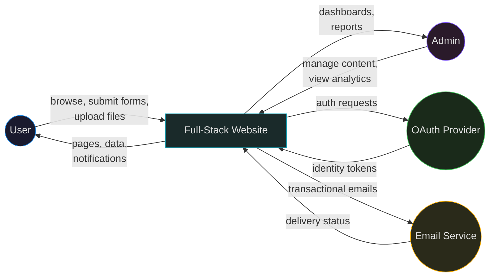
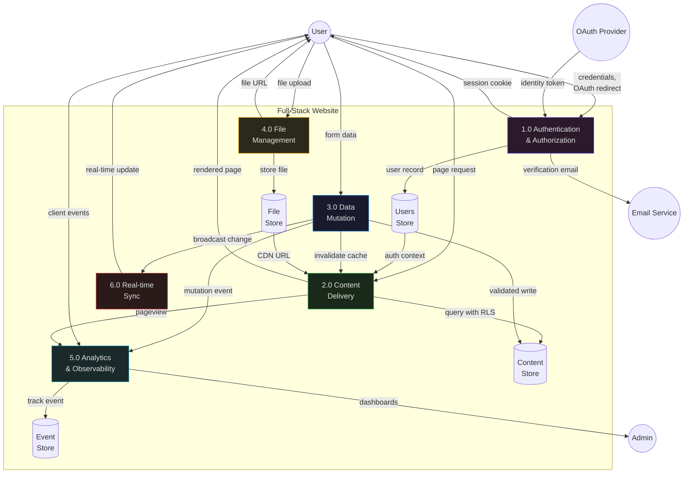
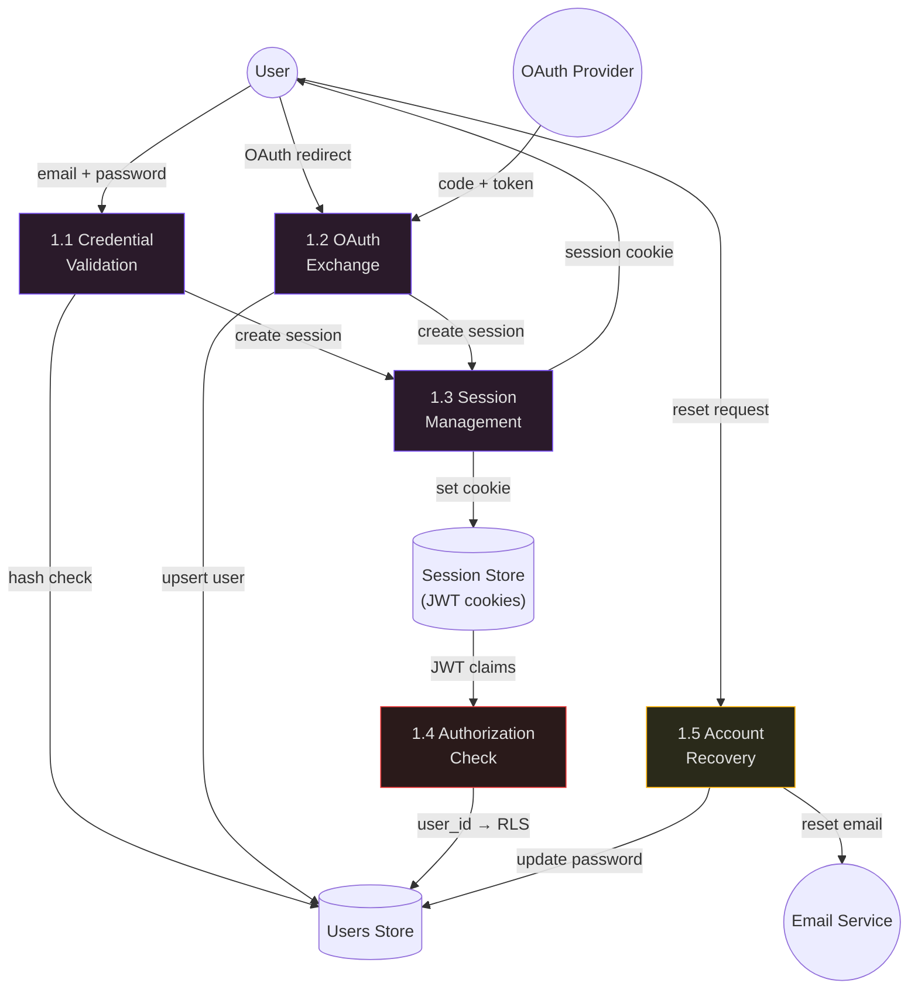
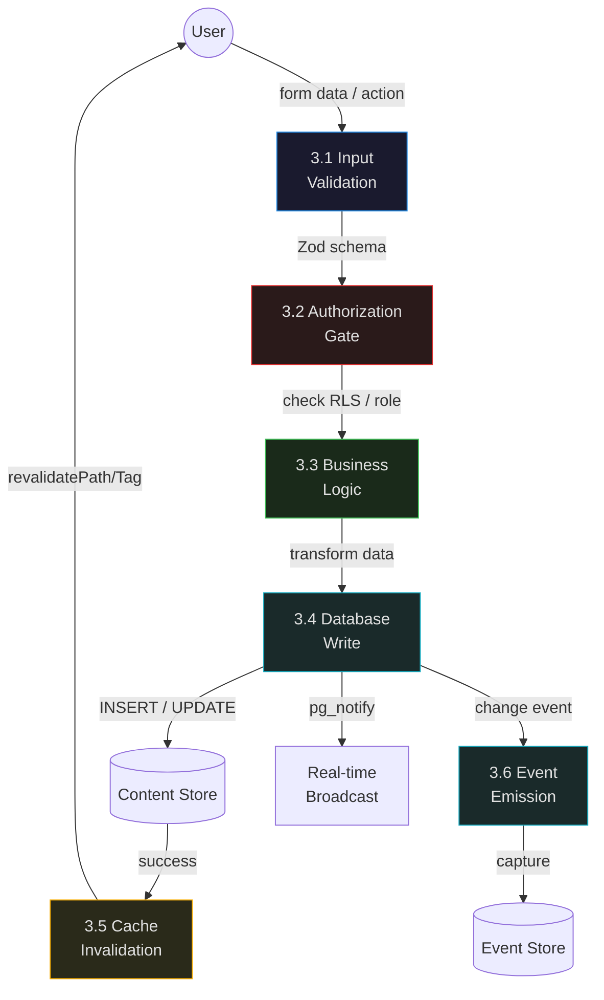
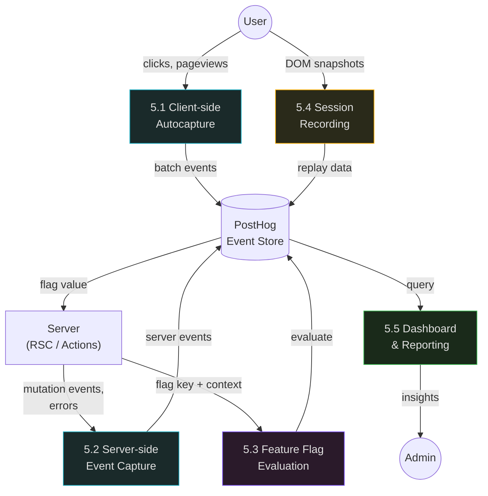

# Data Flow Diagrams

Structured data flow diagrams at three levels of abstraction. Each level zooms into a process from the level above.

---

## Level 0 — Context Diagram

The system as a single process, showing all external entities and data flows.

**External entities:**
| Entity | Role | Data exchanged |
|--------|------|---------------|
| User | End user of the application | Pages, form submissions, file uploads, real-time updates |
| Admin | Internal admin managing content and monitoring | Dashboards, content management, analytics reports |
| OAuth Provider | Google, GitHub for social login | Identity tokens, profile data |
| Email Service | Transactional email delivery | Email payloads, delivery status webhooks |

---

## Level 1 — System Diagram

Decompose the system into major processes.

**Process descriptions:**

| Process | Responsibility | Technology |
|---------|---------------|------------|
| 1.0 Authentication & Authorization | Sign up, sign in, OAuth, MFA, session management, password reset | Supabase Auth, Next.js Middleware |
| 2.0 Content Delivery | Render pages via RSC, serve static assets, apply caching, evaluate feature flags | Next.js App Router, Vercel CDN, PostHog flags |
| 3.0 Data Mutation | Validate input, execute writes, invalidate caches, broadcast changes | Server Actions, Zod, Supabase client |
| 4.0 File Management | Upload, store, serve, resize, delete files | Supabase Storage, Vercel Image Optimization |
| 5.0 Analytics & Observability | Track events, measure performance, manage dashboards, alert on anomalies | PostHog, Vercel Analytics |
| 6.0 Real-time Sync | Broadcast database changes to connected clients | Supabase Realtime (WebSocket) |

**Data stores:**

| Store | Technology | Access pattern |
|-------|-----------|---------------|
| Users Store | Supabase `auth.users` + `public.profiles` | RLS-gated, JWT-authenticated |
| Content Store | Supabase PostgreSQL tables | RLS-gated, server-side queries |
| File Store | Supabase Storage buckets | RLS-gated, CDN-served |
| Event Store | PostHog | Write-only from app, read via PostHog UI/API |

---

## Level 2 — Process Decomposition

### 1.0 Authentication & Authorization

### 3.0 Data Mutation

### 5.0 Analytics & Observability

---

## Data Store Access Matrix

Which processes read from and write to which stores:

| Process | Users Store | Content Store | File Store | Event Store |
|---------|:-----------:|:------------:|:---------:|:----------:|
| 1.0 Auth | R/W | — | — | — |
| 2.0 Content Delivery | R | R | R | — |
| 3.0 Data Mutation | R | R/W | — | W |
| 4.0 File Management | R | W (refs) | R/W | — |
| 5.0 Analytics | R (identify) | — | — | R/W |
| 6.0 Real-time | — | R (stream) | — | — |
