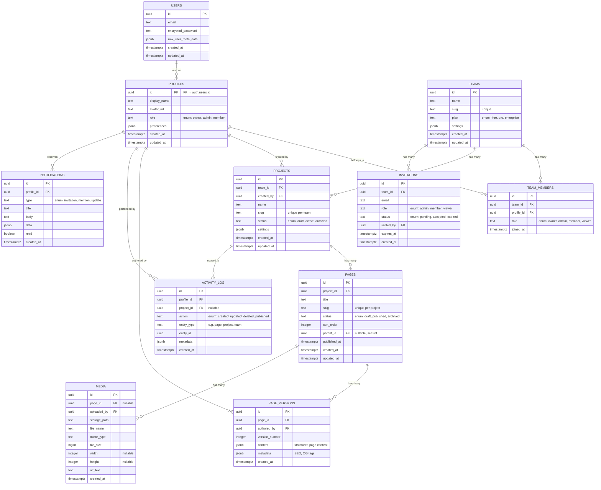

# Data Model

Entity-relationship diagram, schema definitions, RLS policies, and migration strategy for the Supabase PostgreSQL database.

---

## Entity-Relationship Diagram



---

## Schema Definitions (SQL)

### Core Tables

```sql
-- Profiles (extends auth.users)
create table public.profiles (
  id uuid primary key references auth.users(id) on delete cascade,
  display_name text not null default '',
  avatar_url text,
  role text not null default 'member' check (role in ('owner', 'admin', 'member')),
  preferences jsonb not null default '{}',
  created_at timestamptz not null default now(),
  updated_at timestamptz not null default now()
);

-- Auto-create profile on signup
create or replace function public.handle_new_user()
returns trigger as $$
begin
  insert into public.profiles (id, display_name, avatar_url)
  values (
    new.id,
    coalesce(new.raw_user_meta_data->>'full_name', new.email),
    new.raw_user_meta_data->>'avatar_url'
  );
  return new;
end;
$$ language plpgsql security definer;

create trigger on_auth_user_created
  after insert on auth.users
  for each row execute function public.handle_new_user();

-- Teams
create table public.teams (
  id uuid primary key default gen_random_uuid(),
  name text not null,
  slug text not null unique,
  plan text not null default 'free' check (plan in ('free', 'pro', 'enterprise')),
  settings jsonb not null default '{}',
  created_at timestamptz not null default now(),
  updated_at timestamptz not null default now()
);

-- Team members (junction table)
create table public.team_members (
  id uuid primary key default gen_random_uuid(),
  team_id uuid not null references public.teams(id) on delete cascade,
  profile_id uuid not null references public.profiles(id) on delete cascade,
  role text not null default 'member' check (role in ('owner', 'admin', 'member', 'viewer')),
  joined_at timestamptz not null default now(),
  unique (team_id, profile_id)
);

-- Projects
create table public.projects (
  id uuid primary key default gen_random_uuid(),
  team_id uuid not null references public.teams(id) on delete cascade,
  created_by uuid not null references public.profiles(id),
  name text not null,
  slug text not null,
  status text not null default 'draft' check (status in ('draft', 'active', 'archived')),
  settings jsonb not null default '{}',
  created_at timestamptz not null default now(),
  updated_at timestamptz not null default now(),
  unique (team_id, slug)
);

-- Pages
create table public.pages (
  id uuid primary key default gen_random_uuid(),
  project_id uuid not null references public.projects(id) on delete cascade,
  title text not null,
  slug text not null,
  status text not null default 'draft' check (status in ('draft', 'published', 'archived')),
  sort_order integer not null default 0,
  parent_id uuid references public.pages(id) on delete set null,
  published_at timestamptz,
  created_at timestamptz not null default now(),
  updated_at timestamptz not null default now(),
  unique (project_id, slug)
);

-- Page versions (immutable history)
create table public.page_versions (
  id uuid primary key default gen_random_uuid(),
  page_id uuid not null references public.pages(id) on delete cascade,
  authored_by uuid not null references public.profiles(id),
  version_number integer not null,
  content jsonb not null default '{}',
  metadata jsonb not null default '{}',
  created_at timestamptz not null default now(),
  unique (page_id, version_number)
);

-- Media
create table public.media (
  id uuid primary key default gen_random_uuid(),
  page_id uuid references public.pages(id) on delete set null,
  uploaded_by uuid not null references public.profiles(id),
  storage_path text not null,
  file_name text not null,
  mime_type text not null,
  file_size bigint not null,
  width integer,
  height integer,
  alt_text text not null default '',
  created_at timestamptz not null default now()
);

-- Activity log
create table public.activity_log (
  id uuid primary key default gen_random_uuid(),
  profile_id uuid not null references public.profiles(id),
  project_id uuid references public.projects(id) on delete cascade,
  action text not null check (action in ('created', 'updated', 'deleted', 'published')),
  entity_type text not null,
  entity_id uuid not null,
  metadata jsonb not null default '{}',
  created_at timestamptz not null default now()
);

-- Invitations
create table public.invitations (
  id uuid primary key default gen_random_uuid(),
  team_id uuid not null references public.teams(id) on delete cascade,
  email text not null,
  role text not null default 'member' check (role in ('admin', 'member', 'viewer')),
  status text not null default 'pending' check (status in ('pending', 'accepted', 'expired')),
  invited_by uuid not null references public.profiles(id),
  expires_at timestamptz not null default now() + interval '7 days',
  created_at timestamptz not null default now(),
  unique (team_id, email)
);

-- Notifications
create table public.notifications (
  id uuid primary key default gen_random_uuid(),
  profile_id uuid not null references public.profiles(id) on delete cascade,
  type text not null check (type in ('invitation', 'mention', 'update')),
  title text not null,
  body text not null default '',
  data jsonb not null default '{}',
  read boolean not null default false,
  created_at timestamptz not null default now()
);
```

### Indexes

```sql
-- Performance-critical indexes
create index idx_team_members_profile on public.team_members(profile_id);
create index idx_team_members_team on public.team_members(team_id);
create index idx_projects_team on public.projects(team_id);
create index idx_pages_project on public.pages(project_id);
create index idx_pages_parent on public.pages(parent_id) where parent_id is not null;
create index idx_page_versions_page on public.page_versions(page_id);
create index idx_media_page on public.media(page_id) where page_id is not null;
create index idx_activity_log_project on public.activity_log(project_id, created_at desc);
create index idx_activity_log_profile on public.activity_log(profile_id, created_at desc);
create index idx_notifications_profile on public.notifications(profile_id, read, created_at desc);
create index idx_invitations_email on public.invitations(email) where status = 'pending';
```

---

## Row Level Security Policies

Every table has RLS enabled. The core pattern: users can only access data belonging to teams they are a member of.

```sql
-- Enable RLS on all tables
alter table public.profiles enable row level security;
alter table public.teams enable row level security;
alter table public.team_members enable row level security;
alter table public.projects enable row level security;
alter table public.pages enable row level security;
alter table public.page_versions enable row level security;
alter table public.media enable row level security;
alter table public.activity_log enable row level security;
alter table public.invitations enable row level security;
alter table public.notifications enable row level security;

-- Helper: check team membership
create or replace function public.is_team_member(team uuid)
returns boolean as $$
  select exists (
    select 1 from public.team_members
    where team_id = team and profile_id = auth.uid()
  );
$$ language sql security definer stable;

-- Helper: check team role
create or replace function public.team_role(team uuid)
returns text as $$
  select role from public.team_members
  where team_id = team and profile_id = auth.uid()
  limit 1;
$$ language sql security definer stable;

-- Profiles: users can read any profile, update only their own
create policy "profiles_select" on public.profiles for select using (true);
create policy "profiles_update" on public.profiles for update using (id = auth.uid());

-- Teams: members can read their teams
create policy "teams_select" on public.teams for select
  using (public.is_team_member(id));
create policy "teams_update" on public.teams for update
  using (public.team_role(id) in ('owner', 'admin'));

-- Team members: members can read their team's members
create policy "team_members_select" on public.team_members for select
  using (public.is_team_member(team_id));
create policy "team_members_insert" on public.team_members for insert
  with check (public.team_role(team_id) in ('owner', 'admin'));
create policy "team_members_delete" on public.team_members for delete
  using (public.team_role(team_id) in ('owner', 'admin'));

-- Projects: team members can read, admins+ can write
create policy "projects_select" on public.projects for select
  using (public.is_team_member(team_id));
create policy "projects_insert" on public.projects for insert
  with check (public.team_role(team_id) in ('owner', 'admin', 'member'));
create policy "projects_update" on public.projects for update
  using (public.team_role(team_id) in ('owner', 'admin') or created_by = auth.uid());

-- Pages: project team members can read, members+ can write
create policy "pages_select" on public.pages for select
  using (exists (
    select 1 from public.projects p
    where p.id = project_id and public.is_team_member(p.team_id)
  ));
create policy "pages_insert" on public.pages for insert
  with check (exists (
    select 1 from public.projects p
    where p.id = project_id
    and public.team_role(p.team_id) in ('owner', 'admin', 'member')
  ));
create policy "pages_update" on public.pages for update
  using (exists (
    select 1 from public.projects p
    where p.id = project_id
    and public.team_role(p.team_id) in ('owner', 'admin', 'member')
  ));

-- Notifications: users can only read/update their own
create policy "notifications_select" on public.notifications for select
  using (profile_id = auth.uid());
create policy "notifications_update" on public.notifications for update
  using (profile_id = auth.uid());
```

---

## Updated Timestamps

Auto-update `updated_at` on all mutable tables:

```sql
create or replace function public.update_updated_at()
returns trigger as $$
begin
  new.updated_at = now();
  return new;
end;
$$ language plpgsql;

-- Apply to all tables with updated_at
create trigger set_updated_at before update on public.profiles
  for each row execute function public.update_updated_at();
create trigger set_updated_at before update on public.teams
  for each row execute function public.update_updated_at();
create trigger set_updated_at before update on public.projects
  for each row execute function public.update_updated_at();
create trigger set_updated_at before update on public.pages
  for each row execute function public.update_updated_at();
```

---

## Migration Strategy

**Tool:** `supabase migration` CLI

**Convention:**
```
supabase/migrations/
  20260101000000_create_profiles.sql
  20260101000001_create_teams.sql
  20260101000002_create_projects.sql
  20260101000003_create_pages.sql
  20260101000004_create_media.sql
  20260101000005_create_activity_log.sql
  20260101000006_create_invitations.sql
  20260101000007_create_notifications.sql
  20260101000008_add_rls_policies.sql
  20260101000009_add_indexes.sql
```

**Rules:**
- One migration per logical change — never combine unrelated schema changes
- Migrations are forward-only — no editing applied migrations
- Always include `down` logic as a comment for manual rollback reference
- Test migrations against a local Supabase instance before applying to staging
- Use `supabase db diff` to generate migrations from schema changes

**TypeScript types:**
```bash
supabase gen types typescript --local > lib/supabase/database.types.ts
```

This generates types for all tables, views, and functions — used throughout the application for end-to-end type safety.
