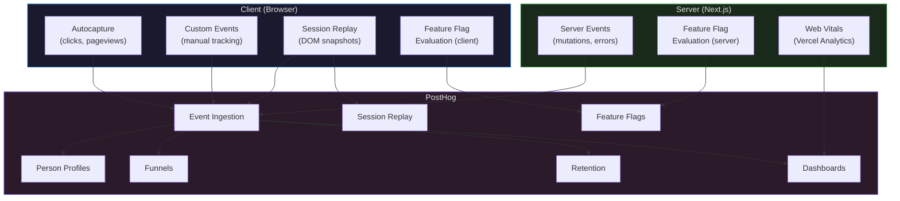

# Observability

PostHog-driven analytics, event taxonomy, feature flags, session replay, and performance monitoring.

---

## Architecture



---

## Event Taxonomy

Structured naming convention: `<object>_<action>` in snake_case.

### Autocaptured Events (no code required)

PostHog captures these automatically:
- `$pageview` — page navigation
- `$pageleave` — page exit
- `$autocapture` — clicks, form submissions, inputs

### Custom Events

| Event | When | Properties |
|-------|------|-----------|
| `user_signed_up` | After successful registration | `method: email\|google\|github` |
| `user_signed_in` | After successful login | `method: email\|google\|github` |
| `user_signed_out` | After sign out | — |
| `team_created` | After creating a team | `plan: free\|pro\|enterprise` |
| `team_member_invited` | After sending invitation | `role: admin\|member\|viewer` |
| `team_member_joined` | After accepting invitation | `role` |
| `project_created` | After creating a project | `team_id` |
| `page_created` | After creating a page | `project_id` |
| `page_published` | After publishing a page | `project_id, page_id` |
| `page_unpublished` | After unpublishing | `project_id, page_id` |
| `file_uploaded` | After successful upload | `mime_type, file_size, bucket` |
| `search_performed` | After executing search | `query, results_count` |
| `error_occurred` | On unhandled error | `error_message, error_stack, route` |
| `feature_used` | On first use of a feature | `feature_name` |

### Server-Side Event Capture

```ts
// lib/posthog/server.ts
import { PostHog } from 'posthog-node'

const posthog = new PostHog(process.env.POSTHOG_API_KEY!, {
  host: process.env.NEXT_PUBLIC_POSTHOG_HOST!,
  flushAt: 1,
  flushInterval: 0,
})

export function captureServerEvent(
  userId: string,
  event: string,
  properties?: Record<string, unknown>
) {
  posthog.capture({
    distinctId: userId,
    event,
    properties: {
      ...properties,
      $lib: 'server',
      environment: process.env.VERCEL_ENV ?? 'development',
    },
  })
}

// Usage in server action:
// captureServerEvent(user.id, 'page_published', { project_id, page_id })
```

### Client-Side Event Capture

```ts
// lib/posthog/client.ts
import posthog from 'posthog-js'

export function capture(event: string, properties?: Record<string, unknown>) {
  posthog.capture(event, properties)
}

// Usage in component:
// capture('page_created', { project_id })
```

---

## User Identification

Sync PostHog identity with Supabase Auth user ID:

```ts
// app/(auth)/auth/callback/route.ts (after OAuth or magic link)
import posthog from 'posthog-js'

// After successful auth:
posthog.identify(user.id, {
  email: user.email,
  name: profile.display_name,
  plan: team.plan,
  created_at: user.created_at,
})
```

**Rules:**
- Always use Supabase `auth.users.id` as `distinctId` — never email
- Set person properties on identify, not on every event
- Call `posthog.reset()` on sign out

---

## Feature Flags

### Server-Side Evaluation (Middleware)

```ts
// middleware.ts
import { PostHog } from 'posthog-node'

const posthog = new PostHog(process.env.POSTHOG_API_KEY!)

export async function middleware(request: NextRequest) {
  const userId = getUserIdFromCookie(request)

  if (userId) {
    const flags = await posthog.getAllFlags(userId)

    if (flags['new-dashboard'] && request.nextUrl.pathname === '/dashboard') {
      return NextResponse.rewrite(new URL('/dashboard-v2', request.url))
    }
  }

  return NextResponse.next()
}
```

### Client-Side Evaluation (Component)

```tsx
'use client'
import { useFeatureFlagEnabled } from 'posthog-js/react'

export function PricingSection() {
  const showNewPricing = useFeatureFlagEnabled('new-pricing')

  if (showNewPricing) {
    return <NewPricingTable />
  }
  return <CurrentPricingTable />
}
```

### Flag Naming Convention

```
<scope>-<feature>
```

Examples:
- `dashboard-v2` — new dashboard version
- `onboarding-tour` — guided onboarding
- `pricing-annual` — annual pricing toggle
- `beta-realtime-collab` — beta feature

### Flag Lifecycle

1. Create flag in PostHog with description and rollout %
2. Implement feature behind flag in code
3. Roll out gradually: 10% → 25% → 50% → 100%
4. Once at 100% and stable, remove flag from code
5. Archive flag in PostHog

---

## Session Replay

**Config:**
```ts
posthog.init(key, {
  session_recording: {
    maskAllInputs: true,          // mask form inputs by default
    maskTextSelector: '.sensitive', // mask elements with .sensitive class
  },
})
```

**When to use:**
- Debug user-reported issues — find the session, watch the replay
- UX research — watch real users navigate flows
- Error investigation — session replay links in error events

**Privacy:**
- All inputs masked by default
- Sensitive data elements masked via CSS class
- Session replay disabled in development
- Respect Do Not Track header

---

## Dashboards

### Core Dashboards

| Dashboard | Metrics | Audience |
|-----------|---------|----------|
| **Product Overview** | DAU, WAU, MAU, signups, activation rate | Product team |
| **Feature Adoption** | Feature flag exposure, conversion by flag | Product team |
| **Engagement** | Pages created, pages published, avg session duration | Product team |
| **Errors** | Error rate by route, error trends, top errors | Engineering |
| **Performance** | LCP, FID, CLS, TTFB by route | Engineering |
| **Growth** | Signups, team creation, upgrade rate, churn | Leadership |

### Web Vitals (Vercel Analytics)

| Metric | Target | Threshold |
|--------|--------|-----------|
| LCP (Largest Contentful Paint) | < 2.5s | Alert at > 4s |
| FID (First Input Delay) | < 100ms | Alert at > 300ms |
| CLS (Cumulative Layout Shift) | < 0.1 | Alert at > 0.25 |
| TTFB (Time to First Byte) | < 200ms | Alert at > 600ms |
| INP (Interaction to Next Paint) | < 200ms | Alert at > 500ms |

---

## Alerting

| Alert | Condition | Channel |
|-------|-----------|---------|
| Error spike | Error rate > 5% over 5min | Slack + email |
| Auth failure spike | `user_signed_in` error rate > 10% | Slack |
| Performance degradation | LCP p95 > 4s for 15min | Slack |
| Feature flag incident | Flag evaluation error rate > 1% | Slack |

---

## Environment Filtering

All events include an `environment` property:
- `production` — live users
- `preview` — PR preview deployments
- `development` — local development

PostHog dashboards filter to `production` by default. Development events are useful for debugging but excluded from product metrics.
