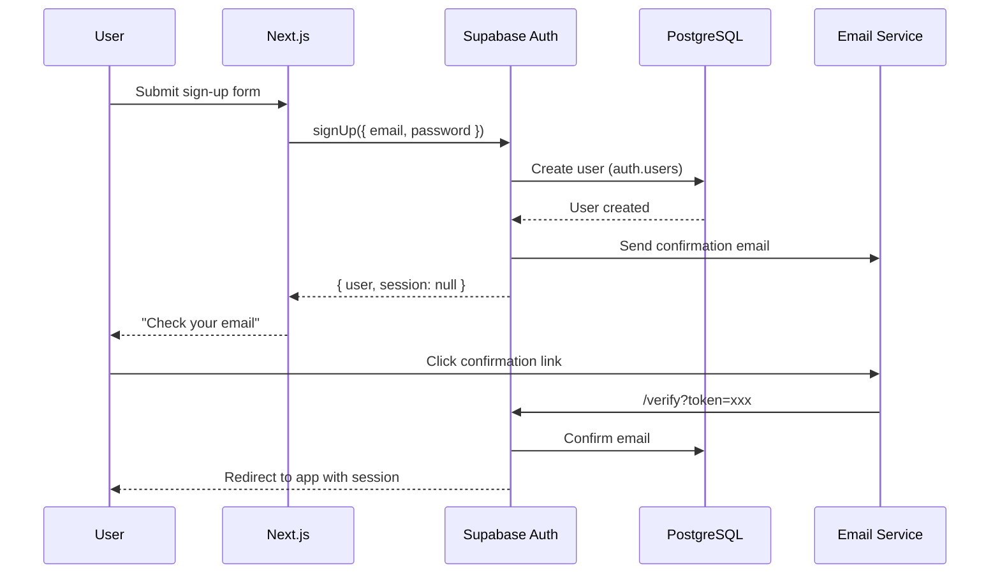
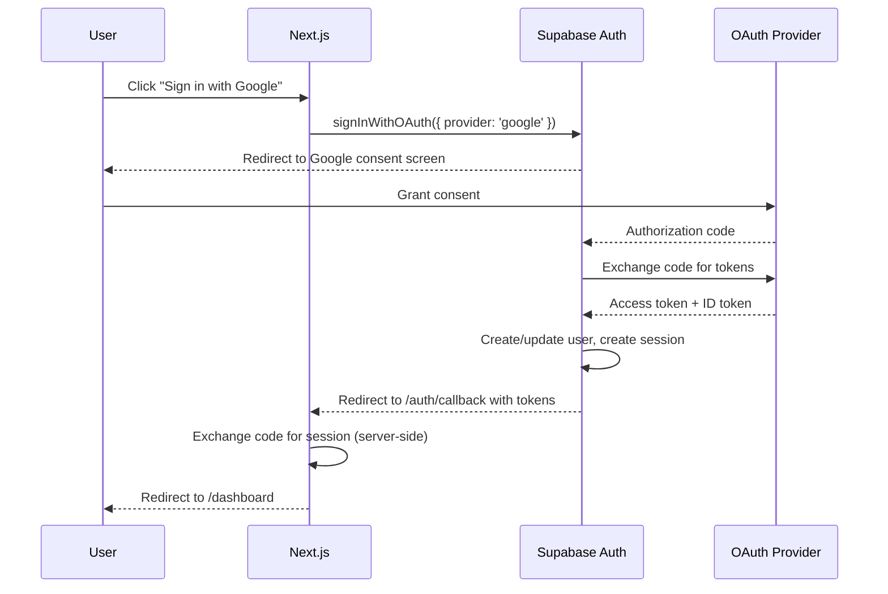
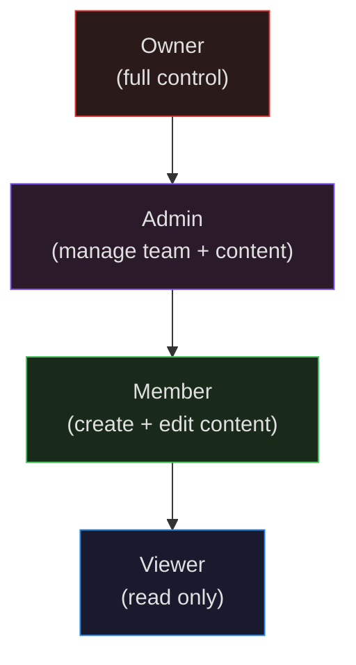

# Security

Authentication flows, authorization model, OWASP compliance, Content Security Policy, and secrets management.

---

## Authentication Flows

### Email + Password



### OAuth (Google / GitHub)



### Auth Callback Handler

```ts
// app/auth/callback/route.ts
import { createClient } from '@/lib/supabase/server'
import { NextResponse } from 'next/server'

export async function GET(request: Request) {
  const { searchParams, origin } = new URL(request.url)
  const code = searchParams.get('code')
  const next = searchParams.get('next') ?? '/dashboard'

  if (code) {
    const supabase = await createClient()
    const { error } = await supabase.auth.exchangeCodeForSession(code)
    if (!error) {
      return NextResponse.redirect(`${origin}${next}`)
    }
  }

  return NextResponse.redirect(`${origin}/auth/error`)
}
```

### Middleware Auth Guard

```ts
// middleware.ts
import { createServerClient } from '@supabase/ssr'
import { NextResponse } from 'next/server'
import type { NextRequest } from 'next/server'

const PUBLIC_ROUTES = ['/', '/auth/login', '/auth/signup', '/auth/callback', '/auth/error']

export async function middleware(request: NextRequest) {
  let response = NextResponse.next({ request })

  const supabase = createServerClient(
    process.env.NEXT_PUBLIC_SUPABASE_URL!,
    process.env.NEXT_PUBLIC_SUPABASE_ANON_KEY!,
    {
      cookies: {
        getAll: () => request.cookies.getAll(),
        setAll: (cookiesToSet) => {
          cookiesToSet.forEach(({ name, value, options }) => {
            response.cookies.set(name, value, options)
          })
        },
      },
    }
  )

  const { data: { user } } = await supabase.auth.getUser()

  const isPublicRoute = PUBLIC_ROUTES.some(route =>
    request.nextUrl.pathname === route || request.nextUrl.pathname.startsWith('/api/public')
  )

  if (!user && !isPublicRoute) {
    const loginUrl = new URL('/auth/login', request.url)
    loginUrl.searchParams.set('next', request.nextUrl.pathname)
    return NextResponse.redirect(loginUrl)
  }

  return response
}

export const config = {
  matcher: ['/((?!_next/static|_next/image|favicon.ico|.*\\.(?:svg|png|jpg|jpeg|gif|webp)$).*)'],
}
```

---

## Authorization Model

### Role Hierarchy



### Permission Matrix

| Action | Owner | Admin | Member | Viewer |
|--------|:-----:|:-----:|:------:|:------:|
| Delete team | X | | | |
| Update team settings | X | X | | |
| Manage billing | X | | | |
| Invite members | X | X | | |
| Remove members | X | X | | |
| Create project | X | X | X | |
| Delete project | X | X | | |
| Create page | X | X | X | |
| Edit page | X | X | X | |
| Publish page | X | X | X | |
| Delete page | X | X | | |
| Upload files | X | X | X | |
| View content | X | X | X | X |
| View analytics | X | X | | |

### Server Action Authorization Pattern

```ts
// lib/auth/authorize.ts
import { createClient } from '@/lib/supabase/server'
import { redirect } from 'next/navigation'

type Role = 'owner' | 'admin' | 'member' | 'viewer'

export async function requireAuth() {
  const supabase = await createClient()
  const { data: { user } } = await supabase.auth.getUser()
  if (!user) redirect('/auth/login')
  return { supabase, user }
}

export async function requireTeamRole(teamId: string, minRole: Role) {
  const { supabase, user } = await requireAuth()

  const roleHierarchy: Record<Role, number> = {
    owner: 4, admin: 3, member: 2, viewer: 1,
  }

  const { data: member } = await supabase
    .from('team_members')
    .select('role')
    .eq('team_id', teamId)
    .eq('profile_id', user.id)
    .single()

  if (!member || roleHierarchy[member.role as Role] < roleHierarchy[minRole]) {
    throw new Error('Insufficient permissions')
  }

  return { supabase, user, role: member.role as Role }
}

// Usage in server action:
// const { supabase, user } = await requireTeamRole(teamId, 'admin')
```

---

## OWASP Top 10 Compliance

| # | Risk | Mitigation |
|---|------|-----------|
| A01 | Broken Access Control | RLS on every table, middleware auth guard, role checks in server actions |
| A02 | Cryptographic Failures | HTTPS everywhere, Supabase handles password hashing (bcrypt), no secrets in client bundles |
| A03 | Injection | Supabase parameterized queries (no raw SQL), Zod input validation, React auto-escapes JSX |
| A04 | Insecure Design | Threat modeling per feature, principle of least privilege, defense in depth (middleware + RLS) |
| A05 | Security Misconfiguration | Strict CSP, security headers via Vercel, no default credentials, `.env` in `.gitignore` |
| A06 | Vulnerable Components | Weekly `npm audit`, Dependabot alerts, pinned dependency versions |
| A07 | Auth Failures | Supabase Auth (battle-tested), MFA support, rate limiting, secure session management |
| A08 | Data Integrity | Input validation (Zod), CSRF protection (SameSite cookies), integrity checks on file uploads |
| A09 | Logging Failures | PostHog event tracking, server-side error capture, audit log table for admin actions |
| A10 | SSRF | No user-controllable URLs in server-side fetches, allowlist for external API calls |

---

## Content Security Policy

```ts
// next.config.ts
const cspHeader = `
  default-src 'self';
  script-src 'self' 'unsafe-eval' 'unsafe-inline' https://us-assets.i.posthog.com;
  style-src 'self' 'unsafe-inline';
  img-src 'self' blob: data: https://*.supabase.co;
  font-src 'self';
  connect-src 'self' https://*.supabase.co wss://*.supabase.co https://us.i.posthog.com;
  frame-src 'self';
  object-src 'none';
  base-uri 'self';
  form-action 'self';
  frame-ancestors 'none';
  upgrade-insecure-requests;
`.replace(/\n/g, '')

// Applied via middleware or vercel.json headers
```

**Notes:**
- `unsafe-eval` required by Next.js in development — remove in production CSP
- `unsafe-inline` for styles is required by Tailwind — can be replaced with nonce-based approach if needed
- PostHog and Supabase domains explicitly allowed
- `frame-ancestors 'none'` prevents clickjacking

---

## Secrets Management

### Environment Variable Classification

| Classification | Prefix | Example | Where |
|---------------|--------|---------|-------|
| Public | `NEXT_PUBLIC_` | `NEXT_PUBLIC_SUPABASE_URL` | Client + server |
| Server-only | None | `SUPABASE_SERVICE_ROLE_KEY` | Server actions, API routes |
| CI-only | None | `VERCEL_TOKEN` | GitHub Actions secrets |

### Rules

1. **Never commit secrets to git** — `.env.local` is in `.gitignore`
2. **Never use `SUPABASE_SERVICE_ROLE_KEY` in client code** — it bypasses RLS
3. **Rotate secrets on team member departure** — Supabase keys, OAuth secrets, API tokens
4. **Use environment-scoped secrets in Vercel** — different values for production vs preview
5. **Access secrets via `process.env`** — never hardcode, never pass as props to client components

### `.env.local` Template

```bash
# .env.local (never committed — copy from .env.example)

# Supabase
NEXT_PUBLIC_SUPABASE_URL=http://localhost:54321
NEXT_PUBLIC_SUPABASE_ANON_KEY=eyJhbGciOiJIUzI1NiIs...
SUPABASE_SERVICE_ROLE_KEY=eyJhbGciOiJIUzI1NiIs...

# PostHog
NEXT_PUBLIC_POSTHOG_KEY=phc_...
NEXT_PUBLIC_POSTHOG_HOST=https://us.i.posthog.com

# App
NEXT_PUBLIC_APP_URL=http://localhost:3000
```

---

## Rate Limiting

| Endpoint | Limit | Window | Implementation |
|----------|-------|--------|---------------|
| Sign up | 5 | 1 hour | Supabase Auth config |
| Sign in | 10 | 15 min | Supabase Auth config |
| Password reset | 3 | 1 hour | Supabase Auth config |
| API routes | 100 | 1 min | Vercel Edge middleware |
| File upload | 20 | 1 hour | Server action check |

---

## Audit Logging

All sensitive operations are logged to the `activity_log` table:

```ts
// lib/audit.ts
import { createClient } from '@/lib/supabase/server'

export async function auditLog(
  userId: string,
  action: 'created' | 'updated' | 'deleted' | 'published',
  entityType: string,
  entityId: string,
  projectId?: string,
  metadata?: Record<string, unknown>
) {
  const supabase = await createClient()
  await supabase.from('activity_log').insert({
    profile_id: userId,
    action,
    entity_type: entityType,
    entity_id: entityId,
    project_id: projectId,
    metadata: metadata ?? {},
  })
}
```
