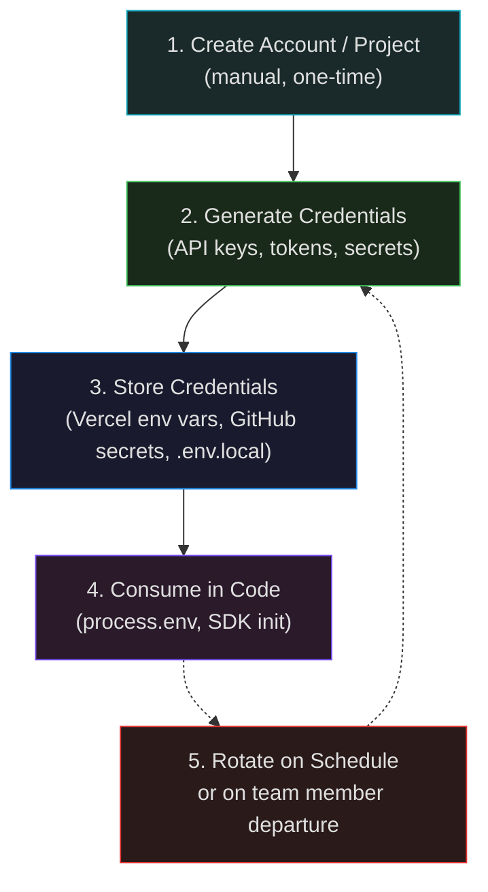
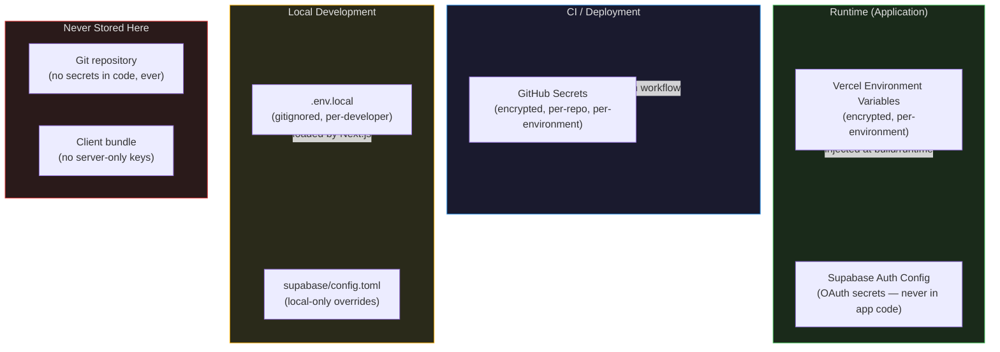

# Service Auth

How every external service credential in the stack is created, stored, rotated, and consumed. This is the single source of truth for Claude to understand the full auth chain across services.

---

## Credential Lifecycle



---

## Master Credential Map

Every credential used in the project, where it comes from, where it's stored, and who consumes it:

| Credential | Service | Created Where | Stored Where | Consumed By | Public? |
|------------|---------|--------------|-------------|-------------|---------|
| `NEXT_PUBLIC_SUPABASE_URL` | Supabase | Project Settings → API | Vercel env, `.env.local` | Supabase client (server + browser) | Yes |
| `NEXT_PUBLIC_SUPABASE_ANON_KEY` | Supabase | Project Settings → API | Vercel env, `.env.local` | Supabase client (server + browser) | Yes |
| `SUPABASE_SERVICE_ROLE_KEY` | Supabase | Project Settings → API | Vercel env (server only), `.env.local` | Server actions (admin ops) | **No** |
| `SUPABASE_DB_PASSWORD` | Supabase | Project creation | GitHub Secret, `.env.local` | Migrations, direct DB access | **No** |
| `SUPABASE_ACCESS_TOKEN` | Supabase | Account → Access Tokens | GitHub Secret | Supabase CLI in CI | **No** |
| `SUPABASE_PROJECT_ID` | Supabase | Project Settings → General | GitHub Secret | CI migration workflow | No (but not secret) |
| `NEXT_PUBLIC_POSTHOG_KEY` | PostHog | Project Settings → Setup | Vercel env, `.env.local` | PostHog JS SDK (browser) | Yes |
| `NEXT_PUBLIC_POSTHOG_HOST` | PostHog | N/A (standard URL) | Vercel env, `.env.local` | PostHog JS SDK (browser) | Yes |
| `POSTHOG_API_KEY` | PostHog | Project Settings → Setup | Vercel env (server only), GitHub Secret | Server-side event capture, CI | **No** |
| `VERCEL_TOKEN` | Vercel | Account → Tokens | GitHub Secret | CI deployment status checks | **No** |
| `GOOGLE_CLIENT_ID` | Google Cloud | APIs & Services → Credentials | Supabase Auth config, `.env.local` | Supabase Auth (OAuth) | Yes |
| `GOOGLE_CLIENT_SECRET` | Google Cloud | APIs & Services → Credentials | Supabase Auth config | Supabase Auth (OAuth) | **No** |
| `GITHUB_CLIENT_ID` | GitHub | Settings → Developer → OAuth Apps | Supabase Auth config, `.env.local` | Supabase Auth (OAuth) | Yes |
| `GITHUB_CLIENT_SECRET` | GitHub | Settings → Developer → OAuth Apps | Supabase Auth config | Supabase Auth (OAuth) | **No** |
| `CLOUDFLARE_API_TOKEN` | Cloudflare | My Profile → API Tokens | GitHub Secret (if using CF Workers) | CI, Terraform, Workers deploy | **No** |
| `CLOUDFLARE_ZONE_ID` | Cloudflare | Domain → Overview sidebar | GitHub Secret (if needed) | CI, Terraform | No (but not secret) |

---

## Per-Service Setup

### Supabase

**Account creation:**
1. Sign up at `supabase.com` with GitHub OAuth (recommended for team SSO)
2. Create an organization for the team
3. Create two projects: `<name>-staging` and `<name>-prod`

**Credential generation:**

| Credential | How to find it |
|------------|---------------|
| Project URL | Project Settings → API → Project URL |
| Anon Key | Project Settings → API → `anon` `public` key |
| Service Role Key | Project Settings → API → `service_role` key (hidden by default, click to reveal) |
| DB Password | Set during project creation — save immediately, cannot be retrieved later (only reset) |
| Project Ref | Project Settings → General → Reference ID |
| Access Token | `supabase.com/dashboard/account/tokens` → Generate new token |

**How credentials are used in code:**

```ts
// Browser + Server (safe to expose — RLS enforces access)
const supabase = createClient(
  process.env.NEXT_PUBLIC_SUPABASE_URL!,     // project URL
  process.env.NEXT_PUBLIC_SUPABASE_ANON_KEY!  // anon key (RLS-gated)
)

// Server-only admin operations (bypasses RLS — never expose to client)
const supabaseAdmin = createClient(
  process.env.NEXT_PUBLIC_SUPABASE_URL!,
  process.env.SUPABASE_SERVICE_ROLE_KEY!      // full access, no RLS
)
```

**Why two keys:**
- `anon` key: safe for client-side, all queries go through RLS. Even if leaked, users can only access their own data.
- `service_role` key: bypasses all RLS. Used for admin operations, migrations, seeding. **Never in client bundles.**

**Local development:**
```bash
supabase start
# Outputs all local credentials:
#   API URL: http://localhost:54321
#   anon key: eyJhbGci...
#   service_role key: eyJhbGci...
```
Local keys are hardcoded test values — safe to commit in test fixtures.

**Rotation:**
- Anon and service role keys: regenerate via Project Settings → API → Regenerate keys. Update Vercel env vars immediately.
- DB password: reset via Project Settings → Database → Reset password.
- Access token: revoke at account level, generate new one.

---

### Vercel

**Account creation:**
1. Sign up at `vercel.com` with GitHub OAuth
2. Create a team (for collaboration)
3. Import the GitHub repository as a new project

**Credential generation:**

| Credential | How to find it |
|------------|---------------|
| Vercel Token | Account Settings → Tokens → Create Token (set scope: full account or specific team) |
| Project ID | Project Settings → General → Project ID |
| Team ID | Team Settings → General → Team ID |

**How credentials are used:**

```bash
# CI: check deployment status
curl -H "Authorization: Bearer $VERCEL_TOKEN" \
  https://api.vercel.com/v6/deployments?projectId=$VERCEL_PROJECT_ID
```

Vercel token is only used in CI workflows — it's never in application code. Deployments are triggered by the GitHub integration (no token needed).

**Environment variables in Vercel:**
- Set via: Project Settings → Environment Variables
- Scoped per environment: Production, Preview, Development
- Encrypted at rest, injected at build time and runtime
- **This is the primary store for all runtime secrets in production and preview environments**

**Rotation:** Revoke token in Vercel dashboard, generate new one, update GitHub secret.

---

### Cloudflare

**Account creation:**
1. Sign up at `cloudflare.com`
2. Add the domain — Cloudflare scans existing DNS records
3. Update domain registrar nameservers to Cloudflare's (e.g. `ada.ns.cloudflare.com`, `bob.ns.cloudflare.com`)
4. Wait for propagation (usually < 1 hour)

**Credential generation:**

| Credential | How to find it |
|------------|---------------|
| API Token | My Profile → API Tokens → Create Token (use template: "Edit zone DNS" or custom) |
| Zone ID | Domain dashboard → Overview → right sidebar, under "API" |
| Account ID | Domain dashboard → Overview → right sidebar, under "API" |
| Global API Key | My Profile → API Tokens → Global API Key (legacy — prefer scoped tokens) |

**Scoped API token permissions (recommended):**

| Permission | Scope | Use case |
|-----------|-------|----------|
| Zone: DNS: Edit | Specific zone | Terraform / CI DNS management |
| Zone: Cache Purge: Purge | Specific zone | Post-deploy cache invalidation |
| Account: Workers Scripts: Edit | Account | Workers deployment |

**How credentials are used:**

```bash
# Purge cache after production deploy (in CI)
curl -X POST "https://api.cloudflare.com/client/v4/zones/$CLOUDFLARE_ZONE_ID/purge_cache" \
  -H "Authorization: Bearer $CLOUDFLARE_API_TOKEN" \
  -H "Content-Type: application/json" \
  --data '{"purge_everything":true}'
```

Cloudflare credentials are **never** in application code. They're only used in CI for DNS changes, cache purging, or Workers deployment.

**Rotation:** Revoke token in Cloudflare dashboard, create new scoped token, update GitHub secret.

---

### PostHog

**Account creation:**
1. Sign up at `posthog.com` (cloud) or self-host
2. Create a project for the application

**Credential generation:**

| Credential | How to find it |
|------------|---------------|
| Project API Key (public) | Project Settings → Setup → Client key (starts with `phc_`) |
| Personal API Key (private) | Account Settings → Personal API Keys → Create key |
| Host URL | Project Settings → Setup → Instance URL (e.g. `https://us.i.posthog.com`) |

**How credentials are used:**

```ts
// Client-side (public key — safe to expose)
posthog.init(process.env.NEXT_PUBLIC_POSTHOG_KEY!, {
  api_host: process.env.NEXT_PUBLIC_POSTHOG_HOST!,
})

// Server-side (private key — for server event capture + flag evaluation)
import { PostHog } from 'posthog-node'
const posthog = new PostHog(process.env.POSTHOG_API_KEY!)
```

**Why two keys:**
- Project API key (`phc_`): client-side, identifies the project. Safe to expose — PostHog rate-limits and validates origin.
- Personal API key: server-side, used for server event capture and querying PostHog API. Scoped to a user account.

**Rotation:** Delete key in PostHog dashboard, create new one, update Vercel env vars and GitHub secrets.

---

### Google OAuth

**Account creation:**
1. Go to `console.cloud.google.com`
2. Create a project (or use existing)
3. Enable the "Google Identity" or "People API"
4. Go to APIs & Services → Credentials → Create Credentials → OAuth 2.0 Client ID

**Credential generation:**

| Setting | Value |
|---------|-------|
| Application type | Web application |
| Authorized redirect URIs | `https://<supabase-project-ref>.supabase.co/auth/v1/callback` |
| | `http://localhost:54321/auth/v1/callback` (development) |

This generates a **Client ID** and **Client Secret**.

**Where credentials are stored:**
- **Not in application code or Vercel** — stored directly in Supabase Auth config
- Supabase Dashboard → Authentication → Providers → Google → paste Client ID and Client Secret
- For local dev: set in `supabase/config.toml` under `[auth.external.google]`

**How it's consumed:**
Supabase Auth handles the entire OAuth flow internally. The application only calls:
```ts
await supabase.auth.signInWithOAuth({ provider: 'google' })
```
The Client ID/Secret never appear in Next.js code.

**Rotation:** Generate new credentials in Google Cloud Console, update in Supabase Auth config.

---

### GitHub OAuth

**Account creation:**
1. Go to GitHub → Settings → Developer Settings → OAuth Apps → New OAuth App
2. Or for an organization: Organization Settings → Developer Settings → OAuth Apps

**Credential generation:**

| Setting | Value |
|---------|-------|
| Homepage URL | `https://app.example.com` |
| Authorization callback URL | `https://<supabase-project-ref>.supabase.co/auth/v1/callback` |

This generates a **Client ID** and **Client Secret**.

**Where credentials are stored:**
- Same as Google OAuth — stored directly in Supabase Auth config, not in application code
- Supabase Dashboard → Authentication → Providers → GitHub

**How it's consumed:**
```ts
await supabase.auth.signInWithOAuth({ provider: 'github' })
```

**Rotation:** Generate new client secret in GitHub OAuth app settings, update in Supabase Auth config.

---

### GitHub (Repository / CI)

**Account creation:**
- Repository: created via `gh repo create` or GitHub UI
- Actions: enabled by default on all repositories

**Credential generation:**

GitHub provides automatic `GITHUB_TOKEN` in Actions workflows — no manual setup needed for most operations. For cross-repo or elevated access:

| Credential | How to create |
|------------|--------------|
| `GITHUB_TOKEN` | Automatic in Actions (scoped to repo) |
| Personal Access Token | Settings → Developer Settings → Personal Access Tokens → Fine-grained |
| Deploy Key | Repository Settings → Deploy Keys (read-only SSH access) |

**GitHub Secrets (for storing other service credentials):**
- Repository Settings → Secrets and Variables → Actions → New repository secret
- Scoped per environment: Production, Staging (matches Vercel environments)

**How they're used in CI:**
```yaml
# GitHub Actions — secrets are injected as environment variables
env:
  SUPABASE_ACCESS_TOKEN: ${{ secrets.SUPABASE_ACCESS_TOKEN }}
  VERCEL_TOKEN: ${{ secrets.VERCEL_TOKEN }}
  CLOUDFLARE_API_TOKEN: ${{ secrets.CLOUDFLARE_API_TOKEN }}
```

**Rotation:** Revoke and regenerate in GitHub settings, update affected workflows.

---

## Storage Hierarchy

Where credentials live at each layer, from most to least secure:



**Rules:**
1. **Production/preview secrets** → Vercel environment variables (per-environment)
2. **CI secrets** → GitHub repository secrets (per-environment)
3. **OAuth secrets** → Supabase Auth config (never in app code)
4. **Local development** → `.env.local` (gitignored)
5. **Never in git** — `.env.local` is in `.gitignore`, `.env.example` has placeholder values only

---

## Rotation Checklist

When to rotate all credentials:

| Event | What to rotate |
|-------|---------------|
| Team member leaves | All service keys, OAuth secrets, API tokens |
| Suspected leak | Affected credential immediately, audit others |
| Quarterly review | Vercel token, Cloudflare API token, Supabase access token |
| Supabase key regeneration | Update Vercel env vars, `.env.local`, CI secrets |
| OAuth app changes | Client secret only (Client ID is stable) |

**Rotation steps:**
1. Generate new credential in the source service
2. Update in all storage locations (Vercel env, GitHub secrets, Supabase config)
3. Trigger a redeploy on Vercel to pick up new env vars
4. Verify the application works with new credentials
5. Revoke the old credential in the source service
6. Update `.env.example` if the variable name changed

---

## .env.example

Template checked into git. Contains every variable with placeholder values — never real secrets:

```bash
# Supabase
NEXT_PUBLIC_SUPABASE_URL=http://localhost:54321
NEXT_PUBLIC_SUPABASE_ANON_KEY=your-anon-key
SUPABASE_SERVICE_ROLE_KEY=your-service-role-key

# PostHog
NEXT_PUBLIC_POSTHOG_KEY=phc_your-project-key
NEXT_PUBLIC_POSTHOG_HOST=https://us.i.posthog.com
POSTHOG_API_KEY=phx_your-personal-key

# App
NEXT_PUBLIC_APP_URL=http://localhost:3000

# Playwright (optional — for testing against preview deploys)
PLAYWRIGHT_BASE_URL=http://localhost:3000
```
