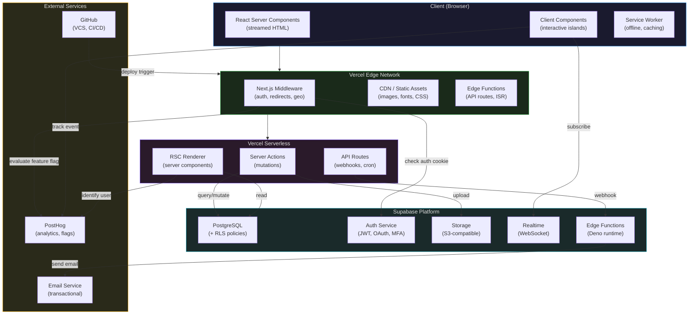
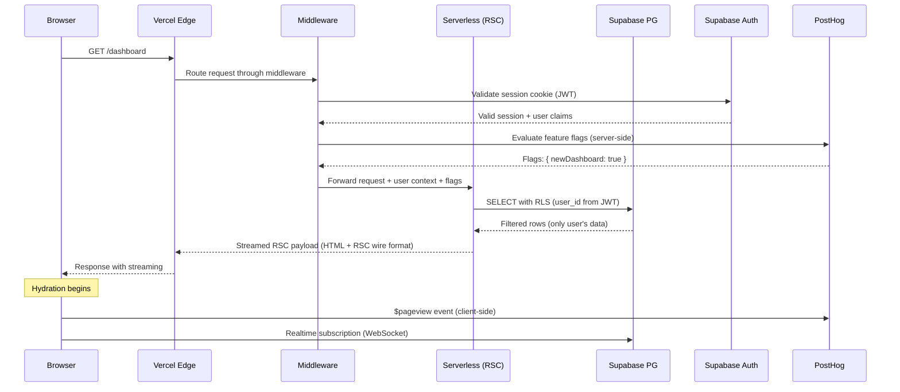
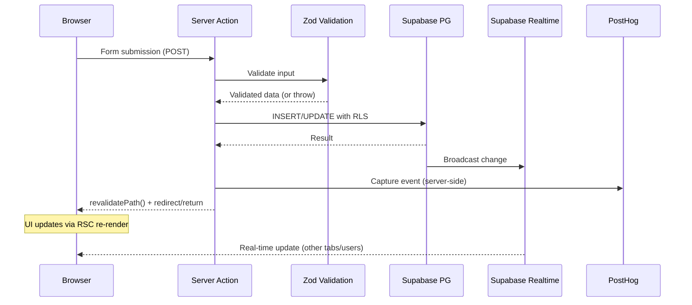
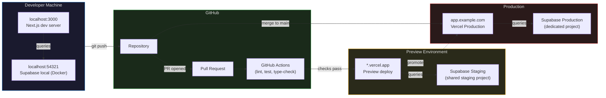
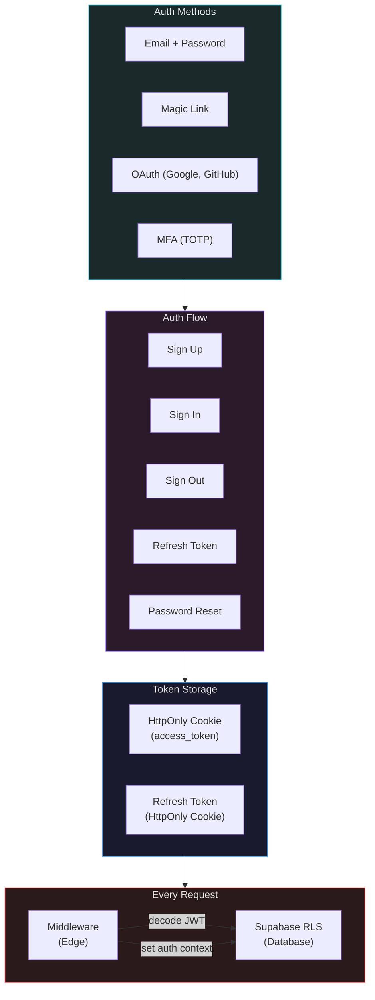

# System Design

High-level architecture for the full-stack website. All diagrams are Mermaid — renderable in GitHub, Obsidian, and any markdown viewer.

---

## Component Architecture



---

## Request Flow — Page Load (Authenticated)



---

## Request Flow — Mutation (Server Action)



---

## Deployment Topology



---

## Authentication Architecture



---

## Caching Strategy

| Layer | Mechanism | TTL | Invalidation |
|-------|-----------|-----|-------------|
| Browser | `Cache-Control` headers | Static: 1yr, Dynamic: 0 | Deploy (new hash) |
| CDN (Vercel) | Edge cache | ISR: configurable | `revalidatePath()` / `revalidateTag()` |
| Next.js | Data Cache (fetch) | Per-fetch `revalidate` | Time-based or on-demand |
| Next.js | Full Route Cache | Build time (static) | Redeploy or `revalidatePath()` |
| Supabase | Connection pooling (Supavisor) | Session-level | Automatic |

**Caching rules:**
- Static pages (marketing, docs): ISR with 1hr revalidation
- Authenticated pages: no cache, server-render every request
- API data: `revalidateTag()` on mutation, never stale
- Images: Vercel Image Optimization, 1yr cache with content hash
- Fonts: self-hosted, immutable cache

---

## Error Handling Strategy

| Layer | Mechanism | Behavior |
|-------|-----------|----------|
| Client | React Error Boundary | Catch render errors, show fallback UI, report to PostHog |
| Server Action | Zod validation + try/catch | Return typed error objects, never throw unhandled |
| Middleware | try/catch | Log error, return 500 response, report to PostHog |
| Database | RLS policy denial | Supabase returns empty result (not 403) — handle in server action |
| API Route | try/catch + status codes | Structured JSON error responses |
| Global | `global-error.tsx` | Catch-all for unhandled errors in the app |

**Error boundary hierarchy:**
```
app/global-error.tsx          ← catches everything
  app/layout.tsx
    app/(auth)/error.tsx      ← catches auth section errors
      app/(auth)/dashboard/error.tsx  ← catches dashboard errors
```
