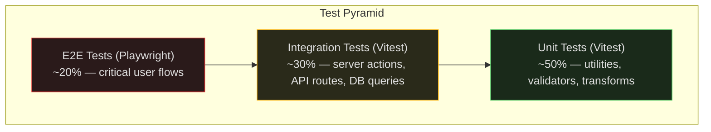

# Testing Strategy

Layered testing approach with Playwright as the primary E2E framework, Vitest for unit/integration tests, and Claude Code parallel agents for exploratory testing.

---

## Test Pyramid



---

## Unit Tests (Vitest)

**What to test:** Pure functions, validators, transforms, formatters, business logic with no external dependencies.

**Config:**
```ts
// vitest.config.ts
import { defineConfig } from 'vitest/config'
import react from '@vitejs/plugin-react'
import tsconfigPaths from 'vite-tsconfig-paths'

export default defineConfig({
  plugins: [react(), tsconfigPaths()],
  test: {
    environment: 'jsdom',
    include: ['**/*.test.ts', '**/*.test.tsx'],
    exclude: ['tests/e2e/**'],
    coverage: {
      provider: 'v8',
      reporter: ['text', 'html', 'lcov'],
      include: ['lib/**', 'components/**'],
      exclude: ['**/*.test.*', '**/*.d.ts'],
      thresholds: {
        statements: 80,
        branches: 75,
        functions: 80,
        lines: 80,
      },
    },
    setupFiles: ['./tests/setup.ts'],
  },
})
```

**Conventions:**
- Test files colocated: `lib/utils/format-date.ts` → `lib/utils/format-date.test.ts`
- Use `describe` for grouping, `it` for assertions
- No mocking Supabase or external services — that's integration territory
- Focus on edge cases, boundary values, error conditions

**Example:**
```ts
// lib/utils/slugify.test.ts
import { describe, it, expect } from 'vitest'
import { slugify } from './slugify'

describe('slugify', () => {
  it('converts spaces to hyphens', () => {
    expect(slugify('hello world')).toBe('hello-world')
  })

  it('removes special characters', () => {
    expect(slugify('hello@world!')).toBe('helloworld')
  })

  it('handles empty string', () => {
    expect(slugify('')).toBe('')
  })

  it('lowercases all characters', () => {
    expect(slugify('Hello World')).toBe('hello-world')
  })

  it('collapses consecutive hyphens', () => {
    expect(slugify('hello   world')).toBe('hello-world')
  })
})
```

---

## Integration Tests (Vitest)

**What to test:** Server actions, API routes, database queries, Supabase client operations — anything that touches the database or external services.

**Setup:** Run against local Supabase instance (Docker).

```ts
// tests/setup.ts
import { beforeAll, afterAll } from 'vitest'
import { createClient } from '@supabase/supabase-js'

const supabase = createClient(
  'http://localhost:54321',
  'eyJhbGciOiJIUzI1NiIsInR5cCI6IkpXVCJ9...' // local anon key
)

beforeAll(async () => {
  // Reset database to clean state
  await supabase.rpc('reset_test_data')
})

afterAll(async () => {
  // Cleanup
})
```

**Conventions:**
- Test files in `tests/integration/`
- One file per server action or API route
- Each test creates its own data, cleans up after
- Never depend on shared mutable state between tests
- Test both happy path and error conditions (invalid input, unauthorized access, RLS denials)

---

## E2E Tests (Playwright)

**What to test:** Critical user journeys end-to-end in a real browser.

### Critical Paths (must have E2E coverage)

| Flow | What it tests |
|------|--------------|
| Authentication | Sign up, sign in, OAuth, sign out, password reset |
| Onboarding | New user → create team → create project |
| Content management | Create page, edit content, publish, unpublish |
| Team management | Invite member, accept invitation, change role, remove |
| File upload | Upload image, attach to page, verify display |
| Search | Search content, filter results, navigate to result |

### Fixture Pattern

```ts
// tests/e2e/fixtures.ts
import { test as base, expect } from '@playwright/test'
import { createClient } from '@supabase/supabase-js'

type Fixtures = {
  supabase: ReturnType<typeof createClient>
  authenticatedPage: Page
  testUser: { email: string; password: string; id: string }
  testTeam: { id: string; slug: string }
}

export const test = base.extend<Fixtures>({
  supabase: async ({}, use) => {
    const client = createClient(
      process.env.NEXT_PUBLIC_SUPABASE_URL!,
      process.env.SUPABASE_SERVICE_ROLE_KEY!
    )
    await use(client)
  },

  testUser: async ({ supabase }, use) => {
    const email = `test-${Date.now()}@example.com`
    const password = 'TestPassword123!'
    const { data } = await supabase.auth.admin.createUser({
      email,
      password,
      email_confirm: true,
    })
    await use({ email, password, id: data.user!.id })
    // Cleanup
    await supabase.auth.admin.deleteUser(data.user!.id)
  },

  testTeam: async ({ supabase, testUser }, use) => {
    const { data } = await supabase
      .from('teams')
      .insert({ name: 'Test Team', slug: `test-${Date.now()}` })
      .select()
      .single()
    await supabase.from('team_members').insert({
      team_id: data!.id,
      profile_id: testUser.id,
      role: 'owner',
    })
    await use({ id: data!.id, slug: data!.slug })
    await supabase.from('teams').delete().eq('id', data!.id)
  },

  authenticatedPage: async ({ page, testUser }, use) => {
    await page.goto('/auth/login')
    await page.getByLabel('Email').fill(testUser.email)
    await page.getByLabel('Password').fill(testUser.password)
    await page.getByRole('button', { name: 'Sign in' }).click()
    await page.waitForURL('/dashboard')
    await use(page)
  },
})

export { expect }
```

### Test Example

```ts
// tests/e2e/auth.spec.ts
import { test, expect } from './fixtures'

test.describe('Authentication', () => {
  test('sign up with email and password', async ({ page }) => {
    await page.goto('/auth/signup')
    await page.getByLabel('Email').fill('newuser@example.com')
    await page.getByLabel('Password').fill('SecurePass123!')
    await page.getByRole('button', { name: 'Sign up' }).click()
    await expect(page.getByText('Check your email')).toBeVisible()
  })

  test('sign in and access dashboard', async ({ authenticatedPage }) => {
    await expect(authenticatedPage).toHaveURL('/dashboard')
    await expect(authenticatedPage.getByRole('heading', { name: 'Dashboard' })).toBeVisible()
  })

  test('sign out redirects to home', async ({ authenticatedPage }) => {
    await authenticatedPage.getByRole('button', { name: 'Sign out' }).click()
    await expect(authenticatedPage).toHaveURL('/')
  })

  test('unauthorized access redirects to login', async ({ page }) => {
    await page.goto('/dashboard')
    await expect(page).toHaveURL(/\/auth\/login/)
  })
})
```

### Parallel Test Execution

**CI sharding:** 4 shards in GitHub Actions (see ci-cd.md)

**Claude Code parallel agents:**
```
Spin up three parallel sub-agents using the Playwright CLI skill.
Test the authentication flow:
- Agent 1: test email/password sign up and sign in
- Agent 2: test OAuth flows (Google, GitHub)
- Agent 3: test error cases (invalid credentials, expired sessions, rate limiting)
```

### Visual Regression Testing

```ts
// tests/e2e/visual.spec.ts
import { test, expect } from './fixtures'

test('homepage matches snapshot', async ({ page }) => {
  await page.goto('/')
  await expect(page).toHaveScreenshot('homepage.png', {
    maxDiffPixelRatio: 0.01,
  })
})

test('dashboard matches snapshot', async ({ authenticatedPage }) => {
  await expect(authenticatedPage).toHaveScreenshot('dashboard.png', {
    maxDiffPixelRatio: 0.01,
  })
})
```

---

## Test Data Strategy

| Layer | Data source | Reset strategy |
|-------|-----------|---------------|
| Unit | Inline fixtures / factories | N/A (pure functions) |
| Integration | Supabase local + seed script | `supabase db reset` before suite |
| E2E | Created per-test via fixtures | Cleanup in fixture teardown |

**Seed script:** `supabase/seed.sql` — creates deterministic test data for local development and CI.

---

## npm Scripts

```json
{
  "scripts": {
    "test:unit": "vitest run",
    "test:unit:watch": "vitest",
    "test:unit:coverage": "vitest run --coverage",
    "test:e2e": "playwright test",
    "test:e2e:headed": "playwright test --headed",
    "test:e2e:ui": "playwright test --ui",
    "test:e2e:debug": "playwright test --debug",
    "test": "npm run test:unit && npm run test:e2e"
  }
}
```
