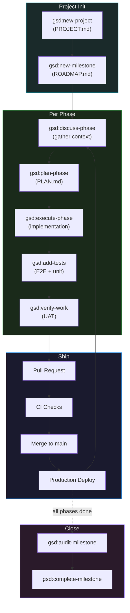

# Workflows

GSD phase-driven development lifecycle, branch strategy, PR conventions, code review, and deployment process.

---

## Development Lifecycle



---

## GSD Phase Workflow

### 1. Discuss

```
/gsd:discuss-phase
```

Claude gathers context about the phase:
- What user problem does this solve?
- What are the acceptance criteria?
- What dependencies exist on other phases?
- What are the technical constraints?

Output: context document stored in `.planning/phases/<N>/`

### 2. Plan

```
/gsd:plan-phase
```

Claude produces `PLAN.md` with:
- Requirements (functional + non-functional)
- Technical approach
- File changes (create/modify/delete)
- UAT criteria (what must be verifiable)
- Risk assessment

**Review the plan before executing.** Plans can be revised:
```
/gsd:plan-phase  # regenerate with feedback
```

### 3. Execute

```
/gsd:execute-phase
```

Claude implements the plan:
- Creates/modifies files as specified in PLAN.md
- Makes atomic commits per logical change
- Runs linting and type-checking after each commit
- Reports progress against the plan

### 4. Test

```
/gsd:add-tests
```

Claude generates tests based on the implementation:
- Unit tests for new utilities and validators
- Integration tests for new server actions
- E2E tests for new user flows (Playwright)
- Tests are committed separately from implementation

### 5. Verify

```
/gsd:verify-work
```

Claude runs UAT against the criteria from PLAN.md:
- Checks each acceptance criterion
- Runs the full test suite
- Reports pass/fail per criterion
- Identifies gaps or regressions

---

## Branch Strategy

```mermaid
gitgraph
    commit id: "initial"
    branch phase/1-project-setup
    commit id: "scaffold"
    commit id: "supabase-setup"
    commit id: "auth-middleware"
    checkout main
    merge phase/1-project-setup id: "Phase 1: Project setup"
    branch phase/2-auth-flow
    commit id: "login-page"
    commit id: "signup-page"
    commit id: "oauth-callback"
    commit id: "tests"
    checkout main
    merge phase/2-auth-flow id: "Phase 2: Auth flow"
    branch phase/3-dashboard
    commit id: "dashboard-layout"
    commit id: "team-selector"
    checkout main
    merge phase/3-dashboard id: "Phase 3: Dashboard"
```

### Branch Naming

```
phase/<N>-<slug>
```

| Example | Phase |
|---------|-------|
| `phase/1-project-setup` | Initial scaffolding |
| `phase/2-auth-flow` | Authentication |
| `phase/3-dashboard` | Dashboard UI |
| `phase/7-billing` | Stripe integration |

### Rules

- One branch per GSD phase
- Branch from `main`, merge back to `main`
- Squash merge (single commit per phase on main)
- Delete branch after merge
- Never push directly to `main`

---

## PR Conventions

### Title Format

```
Phase <N>: <description>
```

Examples:
- `Phase 1: Project scaffolding and Supabase setup`
- `Phase 2: Authentication flow (email, OAuth, MFA)`
- `Phase 5: Page editor with rich content blocks`

### Body Template

```markdown
## Summary
<!-- 1-3 bullet points: what this phase delivers -->

## Changes
<!-- Auto-generated from GSD PLAN.md -->
- Created `app/(auth)/dashboard/page.tsx` — dashboard home
- Created `actions/teams.ts` — team CRUD server actions
- Modified `middleware.ts` — added auth guard for /dashboard/*

## Requirements Met
<!-- From PLAN.md UAT criteria -->
- [x] User can sign in with email/password
- [x] User can sign in with Google OAuth
- [x] Unauthorized access redirects to login
- [x] Session persists across page refreshes

## Test Plan
- [ ] Unit tests pass (`npm run test:unit`)
- [ ] E2E tests pass (`npm run test:e2e`)
- [ ] Manual verification on preview URL
- [ ] No TypeScript errors (`npx tsc --noEmit`)
- [ ] No lint errors (`npm run lint`)
```

### Labels

Apply automatically based on phase:
- `phase:<N>` — phase number
- `type:feature` / `type:fix` / `type:chore` — change type

---

## Commit Conventions

### Format

```
<type>: <description>

[optional body]

Co-Authored-By: Claude Opus 4.6 <noreply@anthropic.com>
```

### Types

| Type | When |
|------|------|
| `feat` | New feature or capability |
| `fix` | Bug fix |
| `refactor` | Code change that doesn't add features or fix bugs |
| `test` | Adding or updating tests |
| `chore` | Build, CI, config, dependency updates |
| `docs` | Documentation only |

### Rules

- One logical change per commit
- Present tense, imperative mood: "add auth flow" not "added auth flow"
- Keep subject line under 72 characters
- Reference the phase in the body if helpful
- Co-author line for AI-assisted commits

---

## Code Review Checklist

Before approving a PR:

### Functionality
- [ ] Meets all acceptance criteria from PLAN.md
- [ ] No regressions in existing features
- [ ] Error states handled gracefully

### Security
- [ ] No secrets in client-side code
- [ ] RLS policies added for new tables
- [ ] Input validation via Zod for all user input
- [ ] Auth checks in all server actions accessing protected data

### Quality
- [ ] TypeScript strict mode — no `any`, no `@ts-ignore`
- [ ] Tests cover critical paths (unit + E2E)
- [ ] No console.log left in production code
- [ ] Components are accessible (keyboard nav, screen reader, ARIA)

### Performance
- [ ] No unnecessary client components (prefer RSC)
- [ ] No N+1 queries (batch or join)
- [ ] Images optimized (next/image, proper sizing)
- [ ] No blocking data fetches in layouts

---

## Local Development Flow

```bash
# 1. Start local Supabase
supabase start

# 2. Apply latest migrations
supabase db reset

# 3. Generate types
supabase gen types typescript --local > lib/supabase/database.types.ts

# 4. Start Next.js dev server
npm run dev

# 5. Open in browser
open http://localhost:3000

# 6. (Optional) Open Supabase Studio
open http://localhost:54323
```

### Quick Reference

| Command | What it does |
|---------|-------------|
| `npm run dev` | Start Next.js dev server |
| `npm run build` | Production build |
| `npm run lint` | ESLint check |
| `npm run test:unit` | Run Vitest |
| `npm run test:e2e` | Run Playwright |
| `supabase start` | Start local Supabase |
| `supabase db reset` | Reset DB + apply migrations + seed |
| `supabase gen types typescript --local` | Regenerate types |
| `supabase migration new <name>` | Create new migration |

---

## Deployment Process

### Standard Deploy (Phase Merge)

1. GSD `verify-work` passes all UAT criteria
2. Push branch, open PR
3. CI checks pass (lint, typecheck, unit tests, E2E)
4. Vercel preview deploy is live
5. Manual smoke test on preview URL
6. Approve and squash merge to `main`
7. Vercel auto-deploys to production
8. Migration workflow applies pending SQL migrations
9. Post-deploy smoke test (automated)

### Hotfix Deploy

1. Branch from `main`: `hotfix/<description>`
2. Fix the issue, add a test for the regression
3. PR with `priority:high` label
4. Fast-track review (1 approval)
5. Merge and auto-deploy

### Rollback

If a production deploy causes issues:
1. **Preferred:** Fix forward — deploy a hotfix
2. **If urgent:** Revert the merge commit on `main`, auto-deploys previous state
3. **Database:** Migrations are forward-only — create a new migration to undo schema changes if needed
4. **Never** use `git push --force` on `main`
