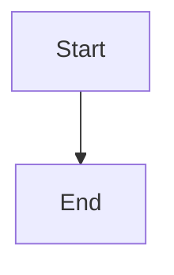
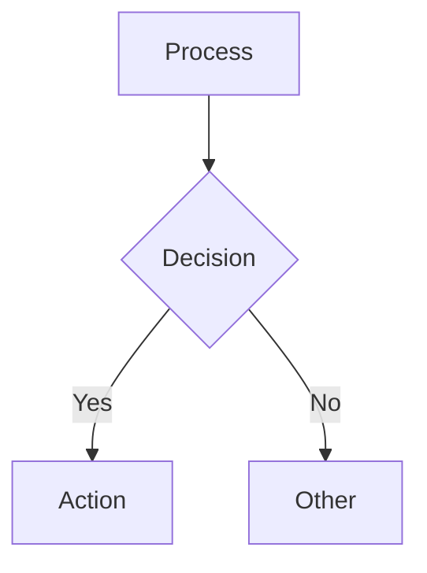
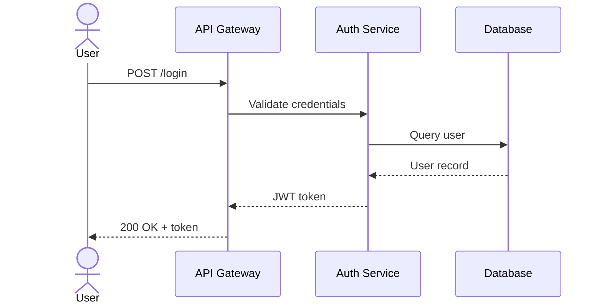
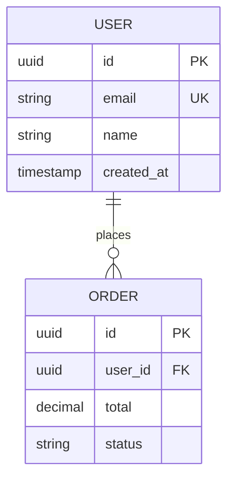
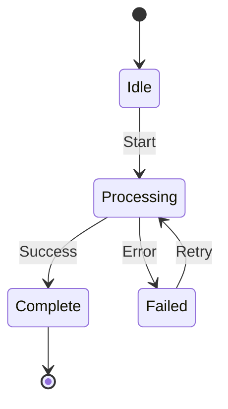
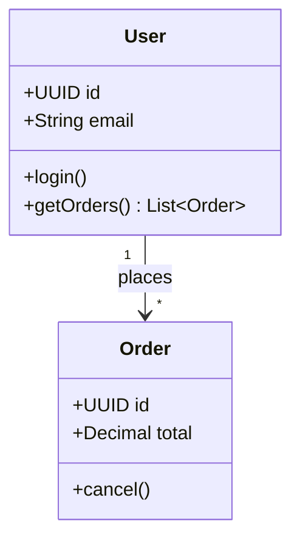
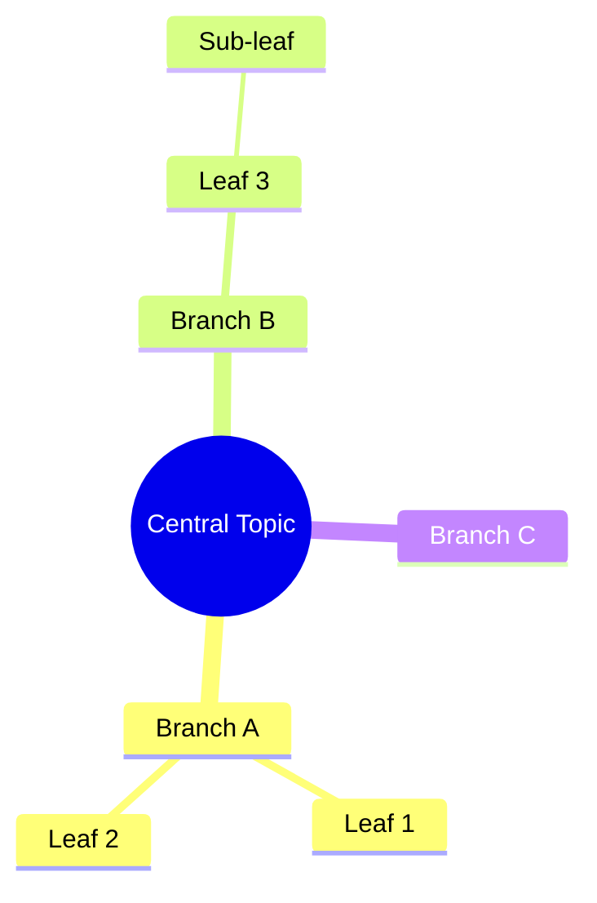
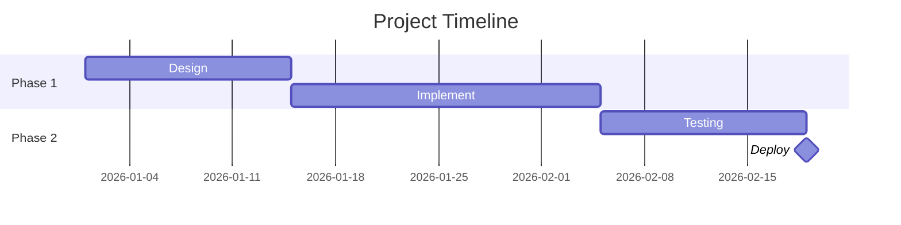
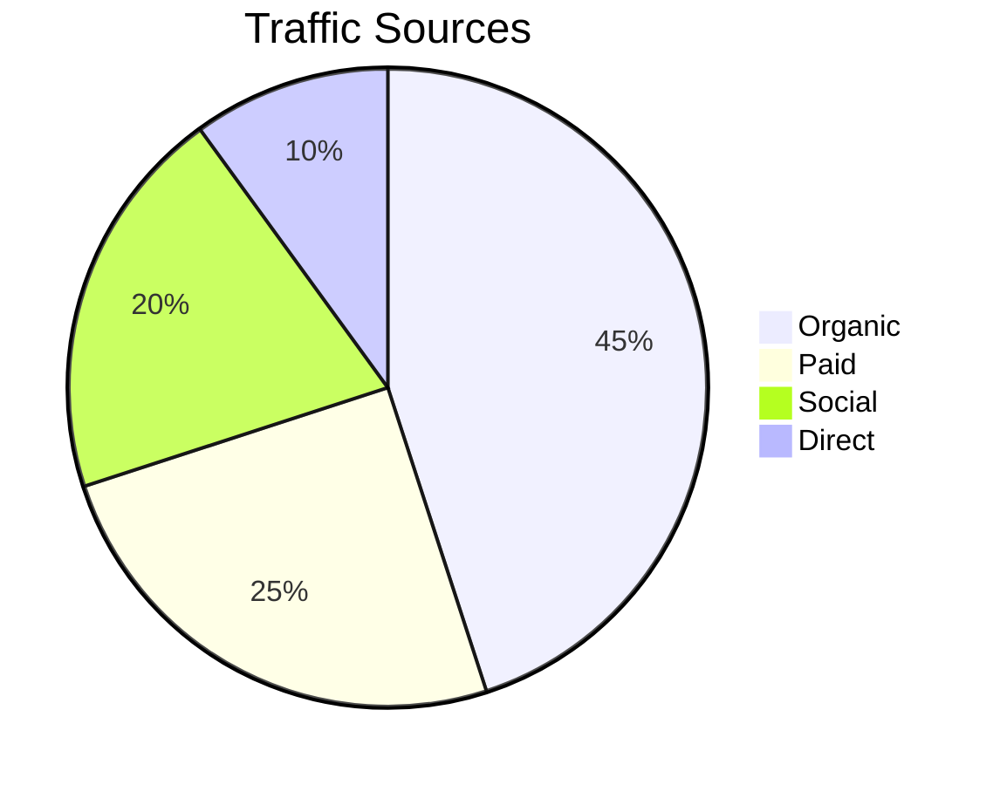

# Mermaid Format Reference

## Overview
Mermaid diagrams render natively in Obsidian inside fenced code blocks — no plugins needed.

````markdown

````

## Diagram Types & When to Use Each

### 1. Flowchart / Data Flow Diagram (DFD)
**Use for**: Process flows, data movement, decision logic, DFD Level 0/1/2



**Shape syntax**:
- `[text]` — Rectangle (process)
- `{text}` — Diamond (decision)
- `([text])` — Rounded rect (terminal)
- `[(text)]` — Cylinder (database)
- `((text))` — Circle (connector)
- `[/text/]` — Parallelogram (I/O)
- `>text]` — Flag/signal

**Direction**: `TD` (top-down), `LR` (left-right), `BT` (bottom-top), `RL` (right-left)

**Subgraphs** (for grouping):
```
subgraph "Layer Name"
    A[Node A]
    B[Node B]
end
```

### 2. Sequence Diagram
**Use for**: API calls, service communication, request/response flows, protocol exchanges



**Arrow types**:
- `->>` solid with arrowhead
- `-->>` dashed with arrowhead
- `->>+` activate target
- `->>-` deactivate target
- `-x` solid with X (failed)

**Features**: `Note over A,B: text`, `loop`, `alt/else`, `opt`, `par`, `critical`

### 3. Entity Relationship Diagram (ERD)
**Use for**: Database schema, entity relationships, data modeling



**Relationship notation**:
- `||--||` one-to-one
- `||--o{` one-to-many
- `o{--o{` many-to-many
- `||--o|` one-to-zero-or-one

### 4. State Diagram
**Use for**: Component lifecycle, order status, workflow states, FSM



**Features**: `state "Name" as s1`, nested states, `note right of`, `[*]` for start/end

### 5. Class Diagram
**Use for**: OOP design, domain model, service interfaces



**Visibility**: `+` public, `-` private, `#` protected, `~` package
**Relationships**: `<|--` inheritance, `*--` composition, `o--` aggregation, `-->` association

### 6. Mind Map
**Use for**: Brainstorming, topic breakdown, system overview



### 7. Gantt Chart
**Use for**: Project timelines, sprint planning, milestones



### 8. Pie Chart
**Use for**: Data distribution, proportion visualization



## Diagram Selection Matrix

| Scenario | Primary Diagram | Secondary |
|----------|----------------|-----------|
| System architecture | Flowchart (subgraphs) | Mind map |
| API design | Sequence | Flowchart |
| Database design | ERD | Class diagram |
| Order/workflow | State diagram | Sequence |
| OOP / domain model | Class diagram | ERD |
| Project planning | Gantt | Mind map |
| Data pipeline / ETL | Flowchart (LR) | Sequence |
| Decision logic | Flowchart | State diagram |
| Microservice comms | Sequence | Flowchart |
| Feature breakdown | Mind map | Flowchart |

## Styling Tips
- Use `:::className` for node styling
- Wrap labels in quotes for special chars: `A["Node (v2)"]`
- Use `%% comment` for invisible comments
- Keep diagrams under ~30 nodes for readability; split into multiple diagrams if larger
